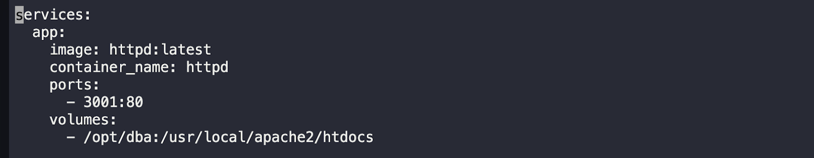
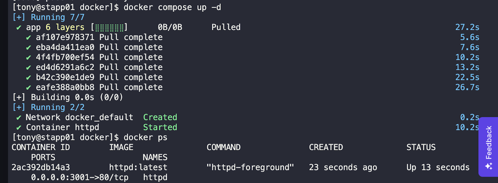
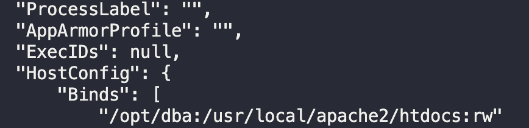

## Setting Up HTTPD Containerized Platform Using DockerCompose

The Nautilus application development team has provided static website content that needs to be hosted on the ⁠ httpd ⁠ web server using a containerized platform. Follow the guidelines below to set up the environment as per their instructions.

### Steps:

 1.⁠ ⁠*I created a dockercompose file on App Server 1 in Stratos DC*
    

    ⁠ bash 
    sudo vi /opt/docker/docker-compose.yml 
   

     ⁠

   

 2.⁠ ⁠*I defined Container with HTTPD Image:*

    In the ⁠ docker-compose.yml ⁠ file, i used the following configuration:

    ⁠ yaml
    version: 3
    services:
      app:
        image: httpd:latest
        container_name: httpd
        ports:
          - 3001:80
        volumes:
          - /opt/dba:/usr/local/apache2/htdocs
      ⁠

 3.⁠ ⁠*Apply Changes:*

    I saved the ⁠ docker-compose.yml ⁠ file and execute the command to apply the changes:

    ⁠ bash
    docker compose up -d or docker-compose -f /opt/docker/docker-compose.yml up -d
    
      ⁠

 3.⁠ ⁠*Confirmed Volume Mapping*

   Using docker inspect i confirmed if it was mapped correctly.
 
